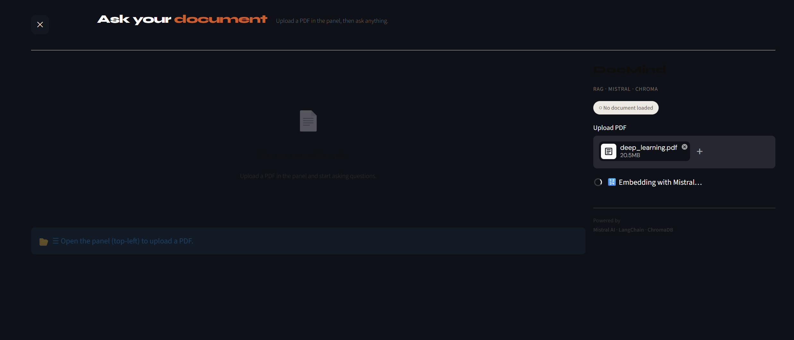
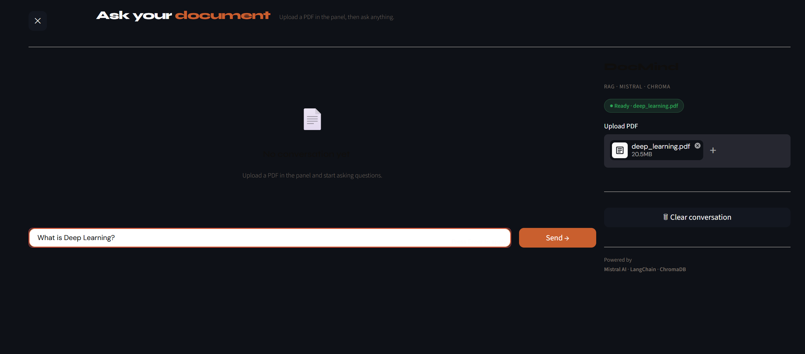
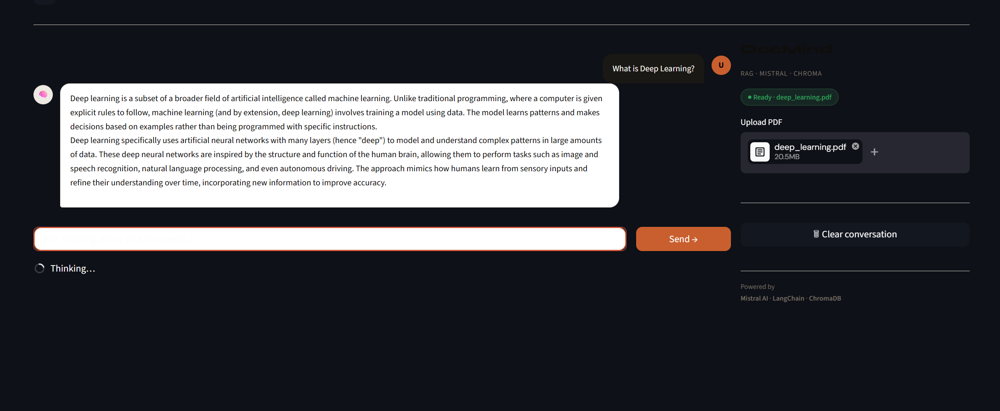
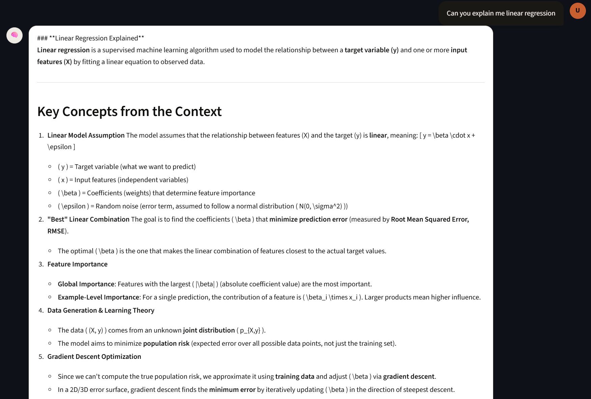
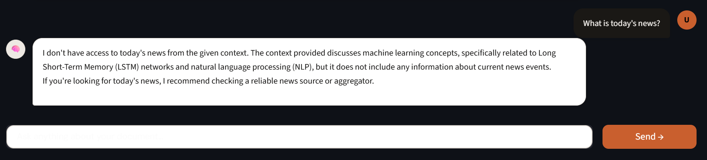

# 📄 GenAI RAG-Based Conversational PDF Assistant

> An AI-powered document assistant that lets you **chat with your PDFs** using Retrieval-Augmented Generation (RAG) — built with LangChain, FAISS, and Streamlit.

---

## 🚀 Features

- 📤 **Upload any PDF** and start asking questions instantly
- 🧠 **RAG pipeline** — retrieves relevant context before generating answers
- 💬 **Conversational interface** — ask follow-up questions naturally
- ⚡ **Fast vector search** using FAISS
- 🎨 **Clean Streamlit UI** with a custom-styled chat input
- 🔒 Runs locally — your documents stay on your machine

---

## 🛠️ Tech Stack

| Layer | Technology |
|---|---|
| Frontend | Streamlit |
| LLM | OpenAI GPT / Gemini / (your model) |
| Embeddings | OpenAI / HuggingFace Embeddings |
| Vector Store | FAISS |
| RAG Framework | LangChain |
| PDF Parsing | PyPDF2 / pdfplumber |

---

## 📁 Project Structure

```
GenAI-RAG-PDF-Assistant/
│
├── app.py                  # Main Streamlit app
├── rag_pipeline.py         # RAG chain setup (retriever + LLM)
├── pdf_processor.py        # PDF loading and chunking
├── vector_store.py         # FAISS index creation and querying
├── requirements.txt        # Python dependencies
├── .env.example            # Environment variable template
└── README.md
```

---

## ⚙️ Setup & Installation

### 1. Clone the repository
```bash
git clone https://github.com/your-username/GenAI-RAG-PDF-Assistant.git
cd GenAI-RAG-PDF-Assistant
```

### 2. Create a virtual environment
```bash
python -m venv venv
source venv/bin/activate        # On Windows: venv\Scripts\activate
```

### 3. Install dependencies
```bash
pip install -r requirements.txt
```

### 4. Set up environment variables
```bash
cp .env.example .env
# Add your API keys to .env
```

**.env file:**
```
OPENAI_API_KEY=your_openai_api_key_here
```

### 5. Run the app
```bash
streamlit run app.py
```

---

## 🧩 How It Works

```
User uploads PDF
       │
       ▼
PDF is parsed & split into chunks
       │
       ▼
Chunks are embedded & stored in FAISS vector store
       │
       ▼
User asks a question
       │
       ▼
Relevant chunks are retrieved via similarity search
       │
       ▼
LLM generates answer using retrieved context (RAG)
       │
       ▼
Answer displayed in chat UI
```

---

## 📸 Screenshots

> _Add screenshots of your app here_

```





```

---

## 📦 Requirements

```
streamlit
langchain
langchain-openai
faiss-cpu
pypdf2
python-dotenv
openai
```

---

## 🔮 Roadmap

- [ ] Multi-PDF support
- [ ] Chat history persistence
- [ ] Support for more file types (DOCX, TXT)
- [ ] Local LLM support (Ollama / LLaMA)
- [ ] Deploy to Streamlit Cloud / HuggingFace Spaces

---

## 🤝 Contributing

Contributions are welcome! Please open an issue or submit a pull request.

1. Fork the repo
2. Create your feature branch (`git checkout -b feature/amazing-feature`)
3. Commit your changes (`git commit -m 'Add amazing feature'`)
4. Push to the branch (`git push origin feature/amazing-feature`)
5. Open a Pull Request

---

## 📄 License

This project is licensed under the MIT License. See the [LICENSE](LICENSE) file for details.

---

## 👤 Author

**Your Name**
- GitHub: [@your-username](https://github.com/your-username)
- LinkedIn: [your-linkedin](https://linkedin.com/in/your-linkedin)

---

> ⭐ If you found this project helpful, please give it a star!
